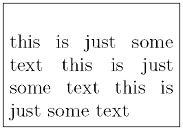
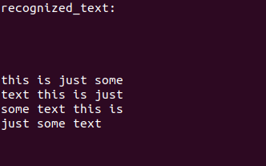

# Text_Recognition_using_tesserocr
<H4> Installation Guide </h4> 
1.Follow installation_guide.txt in repo 

<h4> Usage:</h4> 
1.Only print the text from image 
python3 main.py --image './images/aadhar_demo2.jpg' 

2.Print the each word from image with its confidence 
python3 main.py --image './images/aadhar_demo2.jpg' --confidence True 

<h4> Outputs </h4> 

 <h3> 1.straight image </h3> 
 </img> 
 </img>   

