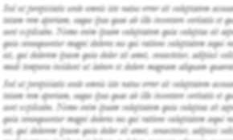
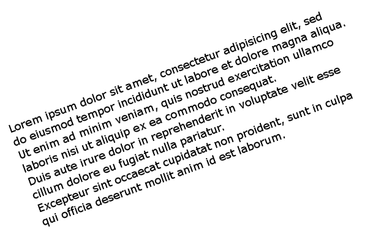
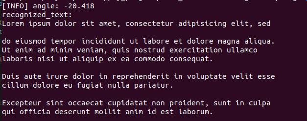

# Text_Recognition_using_tesserocr
<H4> Installation Guide </h4>
1.Follow installation_guide.txt in repo 

<h4> Usage:</h4>
1.Only print the text from image 
$ python3 main.py --image './images/5.png' 

2.Print the each word from image with its confidence 
$ python3 main.py --image './images/5.png' --confidence True 

<h3>Outputs: </h3>

 </img>&nbsp&nbsp&nbsp&nbsp
 </img> 
 Fig:1 OCR on straight image: 

 <h3> 2.blur image </h3> 
 </img>
 <h2>Output:Image is Blur,unable to get OCR.</h2>

 <h3> 3.Rotated image </h3> 
 </img>
 </img>

